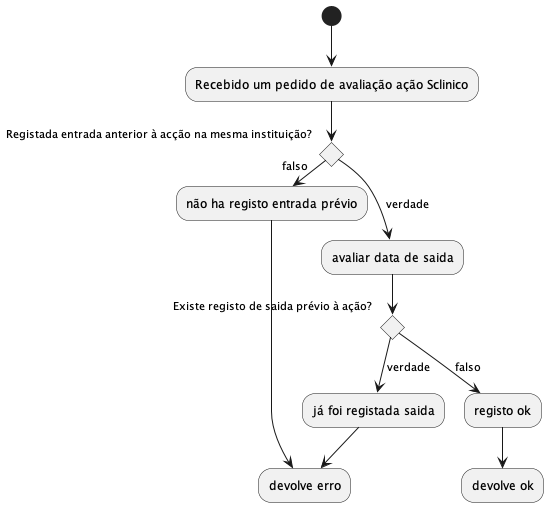

# auditplus

1. git clone
2. `docker-compose up -d` 

## workflow

## Regras aplicadas
| ID | Titulo          | Descrição                                                                                               |
|----|-----------------|---------------------------------------------------------------------------------------------------------|
| 1  | Entrada e saída | Se uma acção do Sclinico for executada sem uma entrada anterior na mesma instituição do lado do sisqual |
| 2  | Outlier         | Modelo machine learning que caracteriza os outliers nos dados sclinico                                  |

### Regra 1

